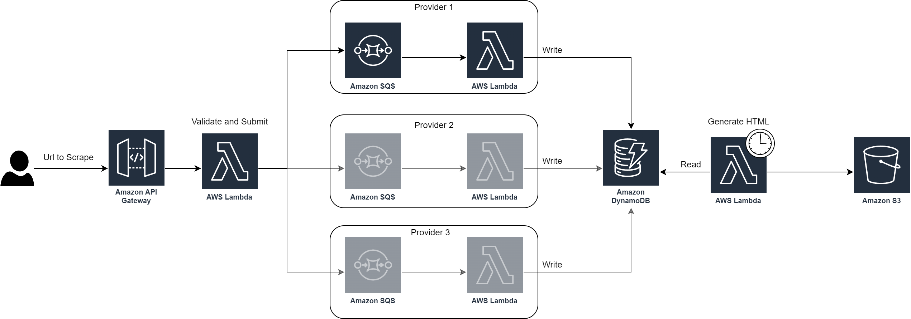

# serverless-scraper

NOTE: This repository is currently an early work-in-progres.

## About the project

This is serverless web scraper built on the AWS platform that, scraping data from different sources, will store them in a database and display them in an unified way on a website.

In particular the scrapers obtainin and standardize data related to house listings on certain (italian) websites. The solution is general enough that it can be easily adapted for other use cases.

## Architecture

* A client sends a request to an API Gateway to scrape a certain URL (MISSING)
* The request is passed to a Lambda function which will validate the URL to only accept supported domains, then it will submit the scrape request to a relavant domain-dependent SQS queue (WIP, MISSING IMPLEMENTATION)
* Each domain-dependent SQS queue has a Lambda function which handles new events added to the queue (DONE)
* The Lambda function scrapes the URL, extracts data and publishes it in a standardized format to a DynamoDB table (WIP, MISSING IMPLEMENTATION)

Periodically:

* The DynamoDB table is read by a Lambda function, which produces an HTML file consisting of all the data scraped from the different sources in a standardized way (MISSING)
* The HTML file is then uploaded to an S3 bucket that the user can access (MISSING)

## Project structure

* `tf/`, terraform files
* `src/`, source code of lambda functions
* `.env.sh.example`, sample environment file

## Development

### Requirements

* Terraform
* a recent Python version

### Setup

* `git clone` the project
* `cp .env.sh.example .env.sh`, then fill `.env.sh` with your AWS credentials
* `cd tf/ && terraform init` to install providers

### Running

* `source .env.sh`
* `cd tf`
* `terraform plan`
* `terraform apply`
